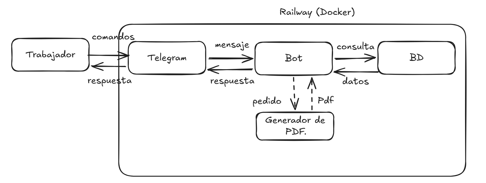

# Oficio Bot 🛠️

Bot de Telegram para trabajadores de oficio (plomeros, electricistas,
pintores, profesores particulares, etc.) que gestionan hoy sus trabajos
por servicio de mensajería (Telegram) y cuaderno. Con Oficio Bot arman
el presupuesto, cobran la seña, reciben recordatorios automáticos si el
cliente no paga, y cierran el cobro final — **todo sin salir de Telegram**.

Proyecto hecho para el concurso **CoderCup T1** de Coderhouse.

👉 Probalo ya: [@mi_oficio_bot](https://t.me/mi_oficio_bot)

## El problema

Un trabajador independiente arma un presupuesto a mano, lo manda por
servicio de mensajería (Telegram), y después tiene que acordarse solo
de quién le debe plata y cuándo. No hay registro prolijo, no hay
recordatorio automático, y el presupuesto casi nunca tiene un formato
profesional.

## Qué resuelve Oficio Bot

- **Presupuestos con PDF profesional** generados en segundos, con los
  datos del trabajador (nombre, oficio, logo opcional).
- **Seguimiento de cobros**: qué trabajo está presupuestado, con seña
  pagada, o cerrado.
- **Recordatorios automáticos** de pago de seña, sin que el trabajador
  tenga que acordarse.
- **Historial de clientes** y resumen mensual de lo cobrado y pendiente.

Todo el flujo vive dentro de una conversación de Telegram — no hay
otra app que instalar ni web que abrir.

## Cómo se usa

| Comando | Qué hace |
|---|---|
| `/start` | Registro inicial (nombre, oficio) |
| `/presupuesto` | Arma un presupuesto nuevo y genera el PDF |
| `/cobrar` | Registra el cobro de un trabajo |
| `/pendientes` | Lista los trabajos sin cobrar |
| `/resumen` | Resumen del mes (cobrado, pendiente, sin enviar) |
| `/clientes` | Historial de clientes y trabajos |
| `/perfil` | Ver o editar nombre, oficio y logo |
| `/reintentar_pdf` | Reintenta generar un PDF que falló |
| `/confirmar_envio` | Confirma que se mandó un presupuesto pendiente |
| `/cancel` | Cancela el flujo en curso |
| `/help` | Lista los comandos disponibles |

Ejemplo de conversación completa en
[`CLAUDE.md`](CLAUDE.md#momento-1--crear-presupuesto-presupuesto).

## Stack

Python 3.12 · [python-telegram-bot](https://github.com/python-telegram-bot/python-telegram-bot)
(async) · [WeasyPrint](https://weasyprint.org/) para el PDF · SQLite
(`aiosqlite`) · Pydantic para validación · deploy en Railway.

Decisiones de arquitectura documentadas en [`docs/adr/`](docs/adr/).

## Arquitectura



El trabajador manda comandos por Telegram, que los reenvía al bot
corriendo en Railway. El bot consulta y guarda datos en la base de
datos en cada interacción; solo cuando arma un presupuesto le pide
además el PDF al generador de PDF — es el único paso opcional del
flujo (línea punteada en el diagrama).

## Correr el bot en local

```bash
git clone <este-repo>
cd oficio-bot
python -m venv venv
venv\Scripts\activate        # Windows
# source venv/bin/activate   # Linux/Mac

pip install -r requirements.txt
cp .env.example .env         # completar TELEGRAM_BOT_TOKEN con el de BotFather

python main.py
```

En local el bot corre en modo **polling** — no hace falta configurar
nada más. Ver [`.env.example`](.env.example) para el resto de las
variables (`REMINDER_DAYS`, `MAX_LOGO_SIZE_MB`, `PDF_DIR`, `DB_PATH`).

Para correr los tests: `pip install -r requirements-dev.txt && pytest`.

## Deploy en Railway

El bot corre en **polling** en local y cambia solo a **webhook** cuando
detecta que está en Railway (ver [`main.py`](main.py) y
[ADR-001](docs/adr/001-stack-tecnologico.md)) — no hay nada que configurar
a mano para elegir el modo.

Pasos para deployar:

1. Crear el proyecto en Railway y conectarlo al repo de GitHub (deploy
   automático en cada push a `main`).
2. Generar un dominio público para el servicio (Settings → Networking →
   Generate Domain). Esto hace que Railway inyecte `RAILWAY_PUBLIC_DOMAIN`
   automáticamente — es la señal que usa `main.py` para arrancar en modo
   webhook.
3. Cargar las variables de entorno del bot en el dashboard (Variables),
   usando [`.env.example`](.env.example) como referencia:
   `TELEGRAM_BOT_TOKEN`, `REMINDER_DAYS`, `MAX_LOGO_SIZE_MB`, `PDF_DIR`,
   `DB_PATH` (ver punto siguiente).
4. **Agregar un Volume** (Settings → Volumes) montado en `/data`. El
   filesystem de Railway es efímero por default: sin Volume, la base
   SQLite y los PDFs generados se pierden en cada redeploy. Con el Volume
   montado, setear:
   ```
   DB_PATH=/data/oficio_bot.db
   PDF_DIR=/data/pdfs
   ```
5. Push a `main` → Railway builda con el [`Dockerfile`](Dockerfile) y
   arranca con el comando de [`railway.toml`](railway.toml).

## Roadmap

- **Fase 2:** link de pago de la seña vía Mercado Pago.
- **Fase 3:** soporte WhatsApp (Meta Cloud API).

Detalle completo en [`docs/backlog.md`](docs/backlog.md).
